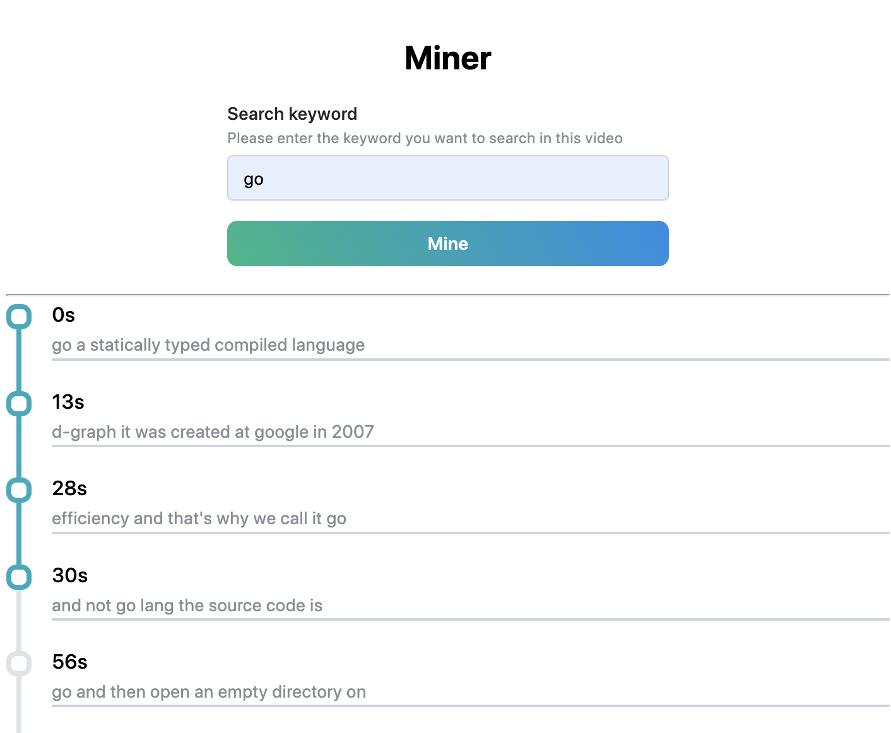

# Video Content Miner Extension

A chrome extension for searching video transcript content and navigate to any line you are interested with a single click.

---

## Screenshot


## Hot to Run
This project depends on [video-content-miner-server](https://github.com/twuoy/video-content-miner-server) project, please clone and start the server if you want to run this extension.

## Build
Run following command to build the extension. The default API url is `http://localhost:50000/api`, you can change it by passing env variable `API_URL`.

```shell
yarn install
yarn build

# if you want to pass env variable
yarn build --env API_URL={YOUR_API_URL}
```

## Load an unpacked extension
1. After build step you will find a `dist` directory in project root.
2. Navigate to `chrome://extensions`.
3. Click the Load unpacked button and select the `dist` extension directory.
- You can find detailed steps in [this Google document](https://developer.chrome.com/docs/extensions/mv3/getstarted/#unpacked).

## How to Use
- Go to the youtube video you want to search.
- Click the extension icon at the top-right corner of the browser.
- Enter your keyword and click `Mine`.
- Navigate to the line you are interested by clicking it.

# Notes
- Only works under youtube domain.
